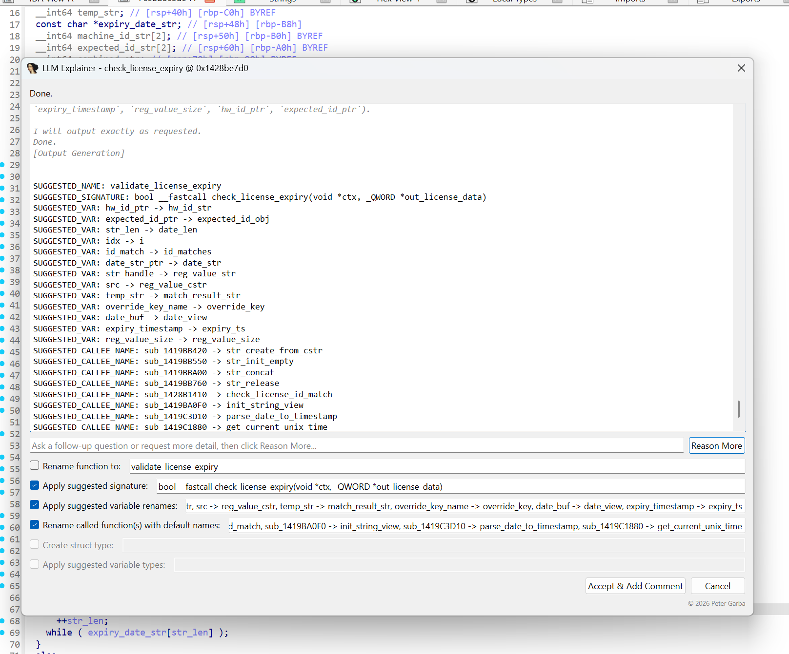
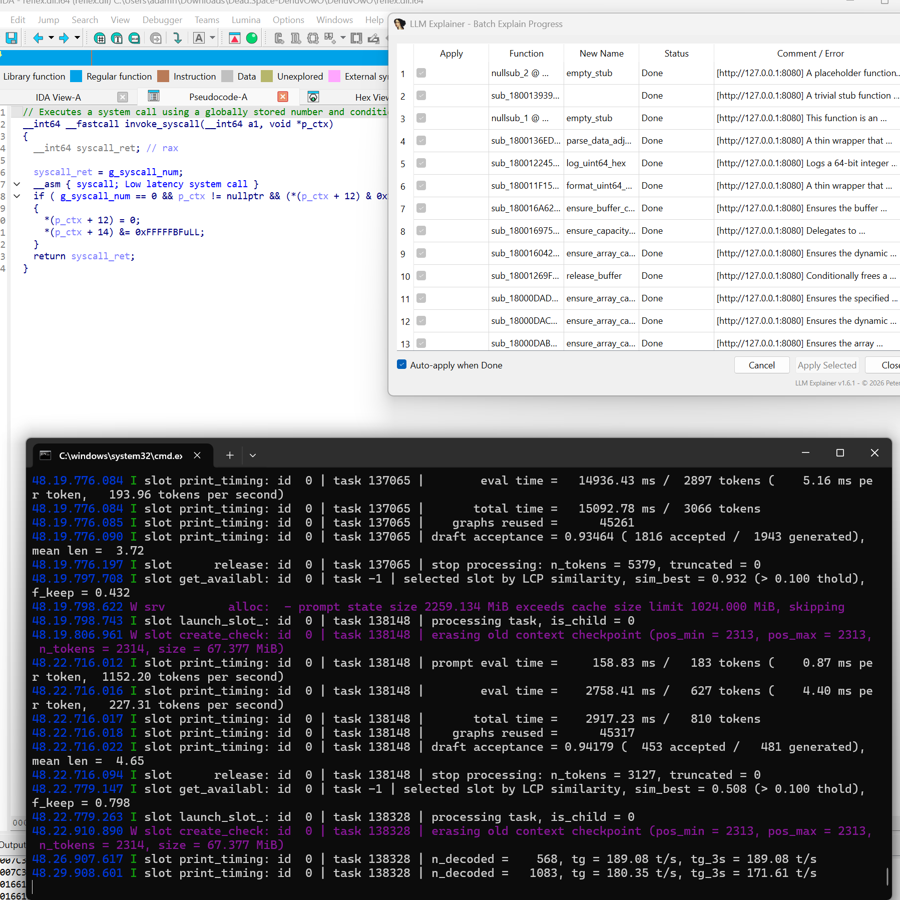

# LLM Explainer

Explain and rename IDA functions with a **local** [llama.cpp](https://github.com/ggml-org/llama.cpp)
server — private, offline, nothing written to your database until you click **Accept**. Works in
the Hex-Rays or the disassembly view.

## Features

- **Right-click → explain** — pseudocode or disassembly view, or a hotkey (`Ctrl-Alt-E`). Answer streams in live; reasoning models show their chain-of-thought separately.
- **Human in the loop** — every suggestion is a separate, editable checkbox. Accept / Reason More / Cancel. The model never writes on its own.
- **Rename & retype** — proposes a function name, full C signature, local-variable renames, **code-label** renames (`LABEL_5` → `cleanup_and_return`), **called-function** renames, and **global/data-variable** renames (`byte_…`, `qword_…` → meaningful names). A called-function rename proposed for code the model hasn't actually seen yet is held back rather than applied blind — an **Investigate & Reconsider Name(s)** button fetches that function's code and asks the model to confirm or revise the name before it's offered for Accept.
- **Struct detection** — infers an undefined struct from pointer-offset access patterns and applies it.
- **Packed-string-table recovery** — spots a helper that slices fixed-length substrings out of one merged string blob (a common obfuscation), then reads the pointer/length constants at every call site and defines each carved string (`get_partial_string(dst, blob, 6)` → `"REFLEX"`).
- **Call-graph aware** — follows callees (configurable depth) and can fetch a specific callee's code on demand mid-answer, or pull in compact call-site snippets from the target's own **callers** (the call expression + inferred argument types, not their full code) to sharpen inferred parameter types, falling back to a caller's full code only if asked for.
- **Export as compilable C** — right-click → *Export function as compilable C…* rewrites the pseudocode as a standalone `.h` + `.c` pair you can paste into a real project: `stdint.h` types instead of `__int64`/`_QWORD`, self-defined replacements for Hex-Rays intrinsics (`LOBYTE`, `__ROL4__`, …), and real struct/enum typedefs converted from IDA's own local types. Everything still living in the binary is bound to `g_image_base + RVA` (original VA in a comment) so it links *and* survives relocation — globals as typed accessors, un-emitted callees as a function-pointer typedef + same-named macro, while imported CRT/OS functions get their real header instead. String literals and small read-only tables are emitted as actual C data, so the result genuinely stands alone. One editable tab per file, **Copy** / **Save Files…**, a **Refine** box, and **Continue** for when the model hits its token limit mid-file. Writes nothing to your database.
- **Compiler-verified export** — the generated files are handed to a real compiler and, if it fails, the diagnostics go straight back to the model to fix, for a couple of automatic rounds — so a missed intrinsic or an undeclared helper is corrected before you ever see it. Finds clang on PATH or in the usual places on **Windows** (the copy Visual Studio bundles, `C:\Program Files\LLVM`), **macOS** (Xcode, the command line tools, Homebrew LLVM) and **Linux** (`/usr/lib/llvm-*`, versioned `clang-NN`), falling back to a system `gcc`/`cc`. **Verify Now** re-checks your hand-edits without asking the model to change anything. Syntax-only by construction: `-fsyntax-only` is forced on, so LLM-written code is type-checked but never assembled, linked or run.
- **Open in Compiler Explorer** — folds the `.h`/`.c` into one translation unit and opens it on [godbolt.org](https://godbolt.org) to try other toolchains and read the generated assembly. Small sessions ride inside the URL, larger ones use the shortener. This is the *only* feature that sends anything off your machine — it always asks first, names the destination, and can be pointed at a self-hosted Compiler Explorer instead.
- **Batch mode** — explain a checklist of functions, review (incl. each proposed new name), apply in bulk.
- **Recursive auto-accept** — explains a function's *undiscovered* (`sub_…`) callees first, then the function itself, so it's analyzed with its callees' real names/signatures already known; applies automatically, and can re-analyze an already-named callee the model flags as misnamed.
- **Multi-server** — list several `llama-server` endpoints for ~Nx parallel batch throughput, with priority order + automatic failover.
- **CFG recovery for obfuscated code** — walks basic blocks, resolves opaque predicates / dead code / flattening dispatchers with a fast deterministic pass (falls back to the LLM only when unsure), then optionally **patches** or **rebuilds** the real control flow. x86/x64 and AArch64.

## Install

Copy `llm_explainer.py` into `<IDA user dir>\plugins\` (Windows: `%APPDATA%\Hex-Rays\IDA Pro\plugins\`) and restart IDA. Requires IDA 9.3+ (PySide6 ships with IDA) and a reachable `llama-server` (default `http://127.0.0.1:8080`). Hex-Rays is optional — it falls back to disassembly. Or install the packaged `dist/*.zip` via [`hcli`](https://hcli.docs.hex-rays.com/).

## Quick start

- **One function** — right-click → *Explain function with LLM…*, review the streamed suggestions, **Accept & Add Comment**.
- **Batch** — Functions window → *Batch Explain Functions…*, check functions, **Apply Selected** when done. A **New Name** column shows the proposed rename per function as it finishes (marked `(kept: …)` when the existing non-default name would be preserved).
- **Recursive** — right-click → *Explain function with LLM (recursively)…*. Auto-applies; capped by *Max recursive callees*; writes unattended, so use with care.
- **Export C** — right-click → *Export function as compilable C…*; it syntax-checks the result with clang and lets the model fix its own errors, then **Save Files…** and build the `.h`/`.c` pair with your own toolchain. Use **Refine** ("target MSVC", "no macros for globals") for anything left.
- **CFG recovery** — disassembly view → *Trace/Recover CFG…*, pick a start address, watch the live transcript/graph, then review each block and pick an **On Accept** mode.

*Batch mode with auto-apply working through a heavily protected x64 binary, powered by a local Qwen model: stub after stub is named, typed and commented the moment it finishes, while llama.cpp's speculative decoding (~94% draft acceptance, ~200 tokens/s) keeps the queue moving — all on consumer hardware (Ryzen 9 9950X, 64 GB DDR5-6000, Radeon RX 7900 XTX 24 GB).*

## CFG patching modes

Chosen on the review screen (all re-verify actual bytes before touching anything, and refuse rather than guess):

- **Mark only** *(default)* — colors + comments blocks. No bytes changed.
- **Patch in place** — NOPs confirmed-dead code and redirects fully-resolved opaque-predicate branches to their real target; ensures a function exists at the entry. Also collapses a single-target computed/indirect jump to a direct branch (incl. AArch64 `BR`/`B.cond`).
- **Rebuild linear** — writes just the real blocks as one straight-line sequence at the entry point, re-encoding every branch/call explicitly; touches only `[entry, entry+size)`.

Results are cached for the session (**Load Cached Result**), and any in-place/rebuild patch is revertible with **Undo Patches**. Opt-in *Enumerate ARM64 computed jump tables* (experimental) recovers `*(base + i*stride + field)` dispatch handlers.

## Configuration

**Edit → Plugins → LLM Explainer.** Persisted as `llm_explainer.cfg.json` in your IDA user dir. Key settings:

| Setting | Default | Notes |
|---|---|---|
| Server base URL(s) | `http://127.0.0.1:8080` | One endpoint per line, priority order, optional `# name`; batch runs across all, with failover |
| Model / API key | *(blank)* | Only if your server needs them |
| Temperature / Max tokens | `0.2` / `16384` | Keep tokens generous for reasoning models |
| Follow calls depth | `0` | `N>0` eagerly includes N levels of callee code |
| Max on-demand code requests | `5` | Cap on the model's `REQUEST_CODE`/`REQUEST_CALLERS` round-trips per conversation |
| Max callers shown per request | `3` | How many callers `REQUEST_CALLERS` returns a compact call-site snippet for (not their full code) |
| Max recursive callees | `10` | Cap for the recursive auto-accept action |
| System prompt(s) | *(editable)* | Explain + CFG-trace + C-export protocols |
| Max globals exported | `40` | How many referenced globals the C export describes (name, VA, RVA, size, type, segment) |
| Embed initialized read-only data | on | Sends the actual bytes of strings/const tables so the exported C can define them as real data |
| Max embedded bytes per global | `512` | Per-global cap; anything larger stays an address-based accessor |
| Verify exported C with a compiler | on | Syntax-checks the export and feeds any errors back to the model |
| C compiler path | *(blank)* | Blank auto-detects clang (Windows/macOS/Linux), then `gcc`/`cc` |
| Compile check flags | `-fsyntax-only -std=c11 -Wall` | `-fsyntax-only` is always forced on; nothing is linked or run |
| Max compile fix rounds | `2` | How often the model may be asked to fix its own compile errors (`0` = report only) |
| Compiler Explorer URL | `https://godbolt.org` | Where *Open in Compiler Explorer* sends code; set a self-hosted instance to keep it internal |
| Compiler Explorer compiler / flags | `cclang2010` / `-std=c11 -Wall` | Preselected there; ids come from `<instance>/api/compilers/c` |
| Resolve branches via constant propagation | on | Fast deterministic pass before the LLM (disable to always ask) |
| Enumerate ARM64 computed jump tables | off | Experimental; see above |
| CFG trace colors / Max blocks | green/red/amber, `200` | REAL / DEAD / UNRESOLVED |

Saved prompts auto-update to the current default when you haven't customized them, so plugin updates take effect without editing the config.

## Prompt protocol

The system prompt asks the model to emit structured lines the plugin parses out of its free-form answer:

| Marker | Purpose |
|---|---|
| `REQUEST_CODE: <fn>` | fetch a callee's code before answering (automatic) |
| `REQUEST_CALLERS[: <fn>]` | fetch a compact call-site snippet (call expression + inferred argument types, not full code) from a few of the target's callers (automatic) |
| `SUGGESTED_NAME: <name>` | function name |
| `SUGGESTED_SIGNATURE: <decl>` | prototype (Hex-Rays only) |
| `SUGGESTED_VAR: <old> -> <new>` | local rename (Hex-Rays only) |
| `SUGGESTED_LABEL: <old> -> <new>` | goto-label rename, e.g. `LABEL_5` (Hex-Rays only) |
| `SUGGESTED_CALLEE_NAME: <fn> -> <new>` | rename a callee whose code was shown |
| `SUGGESTED_GLOBAL_NAME: <g> -> <new>` | rename a referenced global/data variable |
| `SUGGESTED_REANALYZE: <fn> - <why>` | flag an already-named callee for re-analysis (recursive scan) |
| `SUGGESTED_STRUCT: <decl>` | define + register a struct type |
| `SUGGESTED_VAR_TYPE: <var> <type>` | apply a type to a local |
| `SUGGESTED_STRING_EXTRACTOR: <fn> ptr=<n> len=<m>` | flag a helper that slices fixed-length substrings out of a packed string blob; the plugin reads the pointer/length constants at every call site and defines each carved string |
| `BEGIN_FILE: <name>` … `END_FILE` | one emitted source file (C export only); a reply cut off mid-file is stitched back together by **Continue** |

The prose answer itself is kept to one sentence — it becomes the function comment.

## License

MIT — see [LICENSE](LICENSE). © 2026 Peter Garba
